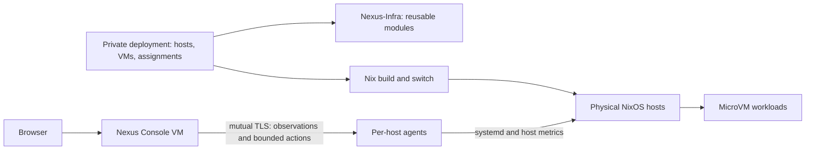

# Nexus Infra

Nexus is a small NixOS infrastructure project for describing physical hosts, running MicroVM workloads, and understanding their live state. Its aim is to keep reproducible configuration, persistent application data, and day-to-day operations understandable as a deployment grows.

This repository contains **reusable modules and the Nexus Console implementation**. Your machines, workloads, addresses, storage mappings and access policy belong in a separate private deployment repository. Nexus is an experimental single-host-tested foundation, not a production-ready cluster orchestrator.

## Desired state and live state

- **Desired state** is the Nix configuration committed to the deployment repository and pinned by its flake lock. Building evaluates it; switching activates it.
- **Live state** is what hosts and VMs are actually doing. The console observes host agents and compares runtime state with the **activated** declarations. It does not inspect pending Git edits or automatically reconcile differences.



The dependency is always **private deployment → Nexus-Infra**. This repository neither imports nor requires access to anyone's private deployment.

## What exists today

| Part | Current responsibility |
| --- | --- |
| Physical hosts | NixOS configuration, KVM, VM lifecycle, host networking and storage backends |
| MicroVM workloads | Declarative NixOS guests; QEMU/KVM defaults, a read-only host Nix-store share, optional persistent directories |
| Persistent storage | A guest requests a named mount; the deployment supplies its host directory; startup waits for the backing filesystem |
| Networking | Deployment-defined VM interfaces, addresses, bridge, firewall and egress policy; no automatic cross-host network |
| Ingress | The current private deployment uses a Traefik VM for local HTTP routing to workloads and the console |
| Network control | The current private deployment runs Headscale for coordination; ordinary VM traffic does not pass through it |
| Nexus Console | Host/VM observations, storage relationships, topology, health probes, action history and explicitly permitted VM lifecycle controls |

**Ingress and Headscale are currently private deployment components**, not exported public Nexus modules. Public modules do not create those VMs or choose addresses, disks, certificates or a network topology for you. The current deployment has not enrolled Tailscale clients or established a cross-host data plane.

## Exported modules

Import these from `nexus-infra.nixosModules`:

| Export | Scope | Purpose |
| --- | --- | --- |
| `host-base` | Physical host | Opinionated baseline for flakes, boot, SSH and administration tools |
| `microvm-host` | Physical host | Pinned upstream `microvm.nix` integration and mount-aware share startup |
| `nexus-agent` | Physical host | Unprivileged observation service with allowlisted systemd actions |
| `vm-base` | Guest | QEMU/KVM, 1 vCPU, 256 MiB RAM and read-only Nix-store sharing by default |
| `vm-persistent` | Guest | `nexus.persistence.<name>.mountPoint` and deployment-supplied `source` |
| `nexus-console` | Guest | Console service; deployment supplies inventory, credentials and persistent storage |
| `workload-base` | nspawn workload | Inner profile for workload containers: nspawn mode, no DHCP/host resolv.conf, no inner Nix |
| `workload-docker` | nspawn workload | `workload-base` plus nested Docker pinned to `crun` with a bounded process limit |

Review `host-base` before importing it: it enables UEFI systemd-boot, DHCP and SSH **password authentication**, disables root SSH login, selects `Europe/Berlin`, and sets state version `26.05`. These are existing baseline choices, not a hardening policy. Override them deliberately for your machine; preserve working administration access. Do not change an existing machine's `system.stateVersion` just to match a release.

## Use Nexus in your own deployment

Your private flake consumes this public repository:

```nix
inputs = {
  nixpkgs.url = "github:NixOS/nixpkgs/nixos-26.05";
  nexus-infra.url = "github:JBHoerter/Nexus-Infra";
  nexus-infra.inputs.nixpkgs.follows = "nixpkgs";
};
```

Commit your `flake.lock`; it pins Nexus, nixpkgs and the upstream MicroVM input. A second public fork is not required to create your own private deployment.

See [Create a deployment](docs/deployment.md) for a minimal host flake and a first VM, and [Storage and networking](docs/storage-network.md) for the deployment boundaries. Run host changes on the intended NixOS host, for example:

```sh
ssh -t YOUR_HOST 'cd /path/to/your/deployment && sudo nixos-rebuild build --flake .#my-host'
ssh -t YOUR_HOST 'cd /path/to/your/deployment && sudo nixos-rebuild switch --flake .#my-host'
```

A build does not activate configuration; switching can restart changed services and VMs. Back up persistent state separately: a flake reproduces configuration, not application data or runtime credentials.

## Nexus Console

The purpose-built console VM uses a Python standard-library backend and a static JavaScript/CSS interface. Host agents sample systemd, host CPU/memory, filesystem capacity, network interfaces and configured HTTP probes. The console polls agents concurrently and browsers poll its cache every five seconds while visible. Unreachable hosts retain clearly marked stale observations.

Actions are limited to configured VM start/stop/restart operations. Authentication, CSRF/Origin checks, mutual TLS and per-unit polkit rules form the boundary; there is no browser shell or arbitrary command endpoint. Runtime credentials and audit state stay outside Git and the Nix store. See [Console architecture and API](console/README.md).

The data model identifies hosts and their workloads separately and accepts multiple agent endpoints. Only a single physical host has been validated; additional-host networking, enrollment and certificate lifecycle remain deployment work.

## Repository layout

```text
flake.nix / flake.lock     Public exports and pinned dependencies
host-modules/             Reusable physical-host capabilities
vm-modules/               Reusable guest capabilities
console/                  Agent, management API, frontend and security tests
docs/                     Deployment, storage and networking guidance
```

## Development model

Nexus is built incrementally in agent-driven passes. A planning conversation produces a bounded prompt — scope, safety rules, inspection-before-change — and an agent executes it over SSH against the target host; each pass lands as commits validated on the running system before the next begins. Work so far was executed by Codex from prompts drafted in a separate ChatGPT planning conversation.

Per-commit provenance and session history are tracked with [Partial](https://github.com/JBHoerter/Partial): a `post-commit` hook plus `.devin/` agent hooks record sessions, and `partial checkpoints` in a checkout shows which session produced each commit. The original transcripts are imported, so `partial search` and the dashboard answer "why was this built this way" directly.

Design intent beyond the current pass, in rough priority order:

- **Fresh-host reproducibility** — provision a new VPS (e.g. Hetzner via `nixos-anywhere` or a pre-built NixOS ISO) and reach the same configuration from this flake plus the private deployment.
- **Separated data layer** — persistent application data lives on dedicated storage so compute can be rebuilt from pinned configuration alone.
- **AI-agent operators** — a dev environment where agents run *against* the infrastructure from inside it.
- **Public ingress** — Cloudflare/DNS/TLS-terminated ingress is deliberately deferred until LAN-mode routing is proven. Headscale stays coordination-only; workload traffic should eventually flow peer-to-peer.
- **Mail service** — a Mailcow-class appliance is under evaluation; it is the least Nix-native piece and not committed yet.

## Limits and contributing

There is no scheduler, migration, automatic failover, distributed storage, historical metrics database or automatic desired-state reconciliation. Persistent volumes share filesystem capacity without per-volume quotas. Console authentication currently has one administrator; certificate rotation is manual. The current deployment uses LAN HTTP ingress, not public TLS/DNS or a production access policy.

Keep reusable mechanisms here and concrete assignments in the deployment. Never commit passwords, private keys, tokens or mutable guest state—even to a private repository. `.gitignore` is only a convenience, not a secret scanner. Public contributions must also avoid private addresses, disk IDs and deployment-specific paths.

For backend changes, run `PYTHONDONTWRITEBYTECODE=1 python3 -m unittest discover -s console -v`. For Nix changes, build a consuming deployment and verify the relevant lifecycle/network/persistence behavior. See the deployment guide for a local input override that avoids publishing unfinished changes.

### Isolated system-container feasibility checks

On an x86_64-linux Nix builder with KVM and the `nixos-test` system feature:

```sh
nix build --no-link --print-build-logs --max-jobs 1 --cores 2 \
  .#checks.x86_64-linux.nspawn-native \
  .#checks.x86_64-linux.nspawn-docker
```

These checks run disposable NixOS test machines, not services on the builder. They exercise private user/network namespaces, restricted mounts, synthetic state transfer, and Docker Compose inside an outer container using the pinned `crun` runtime. The native check uses two 1536 MiB test machines; the Docker check uses one 3072 MiB machine. New files must be tracked for Git-backed flake evaluation, or evaluated using a `path:` source during development. Passing these synthetic checks does not establish Mailcow compatibility, production isolation, or automated workload recovery.

The Mailcow netfilter component check is available as `checks.x86_64-linux.nspawn-mailcow-netfilter`. It fetches digest-pinned public images and tests the nftables backend with reduced network capabilities inside the outer container; it is not a full Mailcow integration test. This component probe uses an isolated Redis fixture and IP-only rules; it does not validate live DNS, SMTP/IMAP, stock privileged Compose behavior, or application-data restoration.

### Explicit Mailcow integration lab

`packages.x86_64-linux.mailcow-integration-lab` builds a test driver for an explicitly run, disposable integration VM. It is not part of the default flake checks because stock DNS health checks and antivirus updates require network access.

Run only on a suitable x86_64-linux KVM builder. The VM uses 8 GiB RAM, two virtual CPUs and a sparse 32 GiB disk. Before starting, require at least 11 GiB available host RAM and 40 GiB available disk space. Run one lab at a time; never activate its configuration on a real host.

```sh
driver=$(nix build --no-link --print-out-paths --max-jobs 1 --cores 2 .#mailcow-integration-lab)
run_dir=$(mktemp -d /tmp/nexus-mailcow-run.XXXXXX)
(cd "$run_dir" && XDG_RUNTIME_DIR="$run_dir" "$driver/bin/nixos-test-driver" \
  --keep-machine-state --output_directory "$run_dir" --junit-xml "$run_dir/results.xml")
```

Use a fresh run directory for each complete execution. The test creates a synthetic domain/mailbox and sends one internal message; replaying the entire script against a completed saved state is not an idempotent recovery operation. Retained VM disks contain synthetic credentials and must remain access-restricted. Disk-backed `XDG_RUNTIME_DIR` avoids filling a small user runtime tmpfs.

The lab uses frozen source/image inputs from `tests/mailcow-lab-inputs.json`, a private UID mapping, pinned `crun`, and a declared process-limit envelope. Mailcow netfilter uses its nftables backend with only `NET_ADMIN`/`NET_RAW` rather than privileged mode. A VM-level egress guard blocks external SMTP and private-network access while allowing initialization DNS, HTTP(S) and ICMP. No host ports are forwarded. Certificates and credentials are generated inside the fixture, and certificate verification remains strict.

Coverage includes stable startup of all 18 services, required Unbound/ClamAV health checks, API domain/mailbox creation, authenticated TLS submission, exact-content IMAP retrieval, and message/certificate persistence after outer-container restart. This is an IPv4 lab with a private test CA and internal delivery. It does not certify public SMTP deliverability, public ACME renewal, IPv6, backup restoration, host-loss recovery or upstream support for nested Mailcow.

Pure helper regressions can run without Nix or Docker:

```sh
PYTHONDONTWRITEBYTECODE=1 python3 -m unittest discover -s tests -p test_mailcow_lab.py -v
```

The Home Assistant/Mosquitto nested-runtime check is `checks.x86_64-linux.nspawn-homeassistant`. It preloads digest-pinned Home Assistant and Mosquitto images, runs both non-privileged under `crun` inside the outer container, verifies that container `network_mode: host` stays inside the workload network namespace, and checks that the Mosquitto retained-message database and the Home Assistant identity and configuration bytes survive an outer-container restart. It is a runtime, isolation and persistence probe only: it does not establish onboarding/authentication correctness, real MQTT integrations, radio hardware support, LAN/multicast discovery, or recovery onto a different host.

The Govee LAN/MQTT component check is `checks.x86_64-linux.nspawn-govee`. A synthetic device fixture on the simulated VM host answers multicast discovery and LAN API commands while digest-pinned govee2mqtt and Mosquitto run non-privileged under `crun` inside the outer container. It verifies LAN API discovery, MQTT-to-LAN command translation, workload-namespace confinement, and repeat behavior after an outer-container restart. It uses no real hardware, credentials or cloud API: physical device behavior, Home Assistant integration, Govee cloud features and recovery onto a different host remain unverified.

The Antragsbank runtime/transfer lab is exported as the parameterized factory `lib.tests.antragsbank`; the private repository invokes it with a sanitized source artifact, a frozen wheelhouse and the immutable event-controls file. It runs the application non-privileged under `crun` inside the outer container, seeds synthetic SQLite/Chroma state without network access, verifies authenticated event listing plus exact acknowledged proposal records compared as complete JSON records across restarts and transfer, checks SQLite integrity, FTS contents, Chroma vectors and control/env bytes across an outer-container restart, and performs a controlled cold state transfer to a fresh simulated host via a numeric-owner tar archive while the source remains stopped. It proves synthetic runtime/API/state behavior and cold transfer only: no production data or credentials are used, equivalence with the running production image is unverified, and it is not a backup engine, fencing mechanism, automatic recovery or host-loss guarantee.

### Host-independent workload artifacts

`lib.buildWorkload` takes a draft workload definition (the `schemaVersion: 2` catalog shape without `revisionDigest` or a runtime artifact entry) plus trusted Nix modules, and returns `{ system; bundle; }`. `system` is a standalone `nixpkgs.lib.nixosSystem` built once from `workload-modules/base.nix`, a hostname module and the caller's modules. It is deliberately not a physical host's `containers.<name>.config`, which embeds host-local settings such as addresses. Hosts bind the shared `system.config.system.build.toplevel` through their own `containers.<name>.path` and supply their own private UID ranges, private-network addresses and physical bind mounts.

`bundle` is a Nix-store directory containing a content-addressed manifest: `artifact.json` (the canonical manifest — closure root, sorted store-path entries with NAR hashes and references), `artifact.sha256` and `definition.json` (the sealed catalog definition carrying the manifest digest as its `runtimeArtifactId` entry). The digest covers the exact manifest JSON bytes, not store-path names; the bundle references the Nix store closure rather than archiving a disk image. It does not verify cache signatures, prove distribution, or provide recovery.

The workload profiles are inner-container configuration only. The host must provide private users, private networking, socket and cgroup boundaries, and persistent bind mounts such as `/var/lib/docker` and `/var/lib/containerd` where needed; importing a profile alone enforces no outer isolation or networking.

`checks.x86_64-linux.workload-artifact` builds one canary workload and binds it on two simulated hosts with different UID offsets, private-network addresses and physical state directories. It verifies the same system closure and guest hostname on both hosts, host-visible UID mapping differences, host-only sentinel and Nix-socket invisibility, a read-only store, and that file bytes copied between the stopped host state directories appear on the second host. This is a binding and layout-portability proof only — not worker orchestration, admission, backup, fencing or automatic recovery.

### Local workload worker (experimental)

`worker.py` implements a root-only local worker reached through `nexus-worker execute`, which reads a bounded strict-JSON request from stdin, and `nexus-worker guard`, an internal unit `ExecCondition`. The `workload-host` NixOS module (`services.nexus-workload-worker`, disabled by default) generates the wrapper and an immutable JSON config pinning the host identity, an approved Nix-store bundle allowlist, capacity ceilings, and per-slot UID bases and private addresses. The worker validates bundle manifests and sealed definitions with the artifact/catalog modules, re-verifies the real store closure against the manifest (`nix path-info` and `nix-store --verify-path` via the local Nix daemon store), refuses secret-bearing or dependency-carrying workloads, requires the configured storage UUID to be mounted before any data directory is created, journals operations and instances in a root-owned SQLite database, and admits work only within measured capacity minus existing reservations. Capacity accounting is deliberately conservative — live usage may be double-counted alongside reservations — and enforces no storage quota.

`prepare` creates owned instance state directories; `start` writes a per-instance `nspawn.env` and resource drop-in, issues a single-use boot-scoped permit consumed by the guard before the upstream nspawn template runs, and reports success only after the unit is observed active; `stop` waits for an inactive unit with a drained cgroup; `observe` reports recorded identity, drain and retired flags plus live unit state without claiming readiness, health, recoverability or fencing. `retire` durably marks an instance unable to start, pass the guard or be re-prepared — the marker commits before the stop is issued and cannot be undone — and still completes only after positive unit/cgroup drain; it is bounded local start-prevention, not off-host fencing or failover. `freeze`/`thaw` implement a durable capture barrier (M4 foundation): freeze atomically records a `held` capture row bound to instance/workload/revision/generation, revokes the start permit and records phase `stopping`, commits before issuing the systemd stop, and acknowledges the freeze only after positive drain; a held row blocks every start and prepare for that workload — inside the worker and inside the guard's atomic permit consume — across crashes, restarts and reboots until a matching thaw releases it, and a frozen instance keeps its full capacity reservation. Thaw requires the exact bound identity plus a still-stopped/drained instance; a thaw against an already-released row is a no-op returning the current recorded phase, and released rows are permanent tombstones against token reuse. Freeze performs no fsync of application data — the VM fixture's explicit `sync` only makes its marker durable across simulated power loss, not an application-consistency or event-durability claim. Freeze/thaw require `backup` **and** `stop` in the definition's allowed operations and claim no application consistency, fencing or backup success. Completed-operation receipts are immutable and replayable; reusing an operation ID with a changed request is rejected.

The worker remains a local root CLI, without HTTP/mTLS, registry ownership, global fencing, automatic failover or production recovery, and the `nexus-workload@` unit is never auto-started or restarted by policy. The local runtime and approved artifact-delivery gates of M2 are verified in isolated tests; registry integration, controller operations and verified recovery follow in later milestones.

`checks.x86_64-linux.workload-worker` drives the worker on two simulated hosts, each with a disposable disk the test formats and mounts by an explicit fixture UUID. It verifies pre-mount rejection with no state creation, manifest/store re-verification, dynamic unit instantiation without a host rebuild or `containers.<name>` declaration, HTTP state round-trips, distinct UID/IP bindings for the same closure, replay without a PID restart, permit-guarded start (a direct `systemctl start` is skipped), bounded stop with cgroup drain, failure on a missing mount, and no auto-activation across an abrupt simulated host power loss. Prepared directories survive that power loss, and runtime files are re-rendered on the next explicit start. The second host exercises a higher-generation manual operator flow. A final subtest verifies the durable capture barrier: a held freeze blocks worker starts, new-generation prepares and direct unit starts across an abrupt host power loss, and only a matching thaw releases it. The current check passes; it is an isolated integration proof, not orchestration, failover or recovery. A graceful `poweroff` of the simulated host currently stalls after `/nix/.ro-store` is unmounted; its cause remains unresolved and graceful shutdown is not verified by this check.

### Local artifact distribution (experimental)

`distribution.py` implements a root-only local fetch worker reached through `nexus-artifacts execute`, reading a bounded strict-JSON request (`fetch` only) from stdin. The `workload-artifacts` NixOS module (`services.nexus-workload-artifacts`, disabled by default) generates an immutable JSON config pinning the administrator-declared trusted Nix Ed25519 public keys, named binary-cache or `file://` sources, and approved `{workloadId, revisionDigest, bundlePath, sourceId}` records. Callers supply only a workload/revision plus a `referenceId`; every URI, key and store path comes from administrator config, never the request. A fetch copies the approved bundle through the Nix daemon with `require-sigs` and the configured trusted keys, pulls matching signatures for already-present paths via `store copy-sigs`, verifies signatures recursively, re-checks the canonical manifest/digest/definition bytes and real store closure, confirms the runtime root belongs to the copied bundle, then pins the bundle via an indirect `nix-store --add-root` gcroot under a root-owned state directory. Each `referenceId` permanently binds to the exact request and approved path/source — a changed binding is rejected rather than overwritten — and a `retained` record is written only after all verification succeeds; retries re-verify instead of trusting stored success, and a failed re-verification downgrades the record back to `pending` without removing the gcroot. There is no expiry, release or GC verb: retention is deliberately permanent and conservative, and deciding which references may eventually be collected is future recovery-point policy, not a local decision. There is no offline key escrow, no network endpoint, no automatic fetch job, no global daemon trust change, and no controller or recovery claim. Downloaded bundles still require explicit approval in the worker config (`approvedBundles`/`approvedBundlePaths`) before any workload can use them; distribution does not authorize execution.

`checks.x86_64-linux.workload-distribution` drives this on two simulated hosts: a publisher builds an ephemeral signing key at test time (kept only in the disposable publisher VM; never committed or copied to the consumer), exports signed and unsigned `file://` caches, and a consumer — an installed VM with a real writable store — fetches the same canary bundle through the local worker — rejecting unsigned and wrongly-signed sources, retaining only the correctly signed closure, surviving daemon GC and abrupt consumer power loss, then starting the retained closure offline without the publisher. The current check passes; it is an isolated integration proof of signed delivery and retention, not a recovery service.

### Local registry core and authenticated API (experimental, M3 isolated verification passed)

`registry.py` is an unprivileged durable placement core; every call takes a `Principal` carrying identity, role and host binding, which the mTLS transport derives solely from the verified client certificate. Its immutable config pins sealed catalog definitions, host identities with declared private addresses, and static service routes. The SQLite journal (WAL, synchronous `FULL`, exclusive nonblocking flock, owner-only files under an owner-only directory) records boot sessions, per-instance observations, placements and idempotent request receipts; every accepted session, observation, placement, publish and withdraw bumps a durable version in the same transaction. Hosts report bounded per-instance samples — worker phase, unit state, drain and retired flags, a declared endpoint address, ready service IDs — gated by session epoch and strictly increasing sequence; replayed, stale, future or out-of-subject samples are rejected without mutating state.

Only the controller may `assign`/`publish`/`withdraw`. CAS assignment reads the current placement generation and inserts the next: a successor requires the incumbent's latest observation to be fresh — current epoch and session, sample age and receipt age both within 30 seconds — AND prove the old instance `retired`, `unitDrained`, `stopped` and inactive/failed. Unreachable, unknown or stale evidence is `retirement-required`, never fencing; this is graceful host-connected transfer only. `publish` additionally requires a fresh running/active/not-drained/not-retired sample listing every routed service; `withdraw` only clears publication and permits no reassignment. `state` distinguishes `running`/`stopped`/`retired` from `stale`/`lost`/`unknown` and never rewrites missing evidence as stopped; `routes` emits short-lived snapshots whose backend derives solely from an authenticated fresh sample plus the preapproved host address and catalog port — ephemeral hints consumed by the ingress guard below, not writer fences. There is no failover, host-down detection or data movement here; controller operations, the host reporter and verified recovery remain pending in later milestones.

`registry_api.py` exposes that core over mutual TLS only — no plaintext listener and no worker-mutating surface. A configured CA verifies client certificates whose subject alternative names must contain exactly one `urn:nexus:<role>:<identifier>` URI SAN mapping to an authorized client; certificate CN is never consulted, roles come from configuration rather than any header, and host principals are bound to their `hostId`. The exact surface is `GET /v2/state`, `GET /v2/assignments`, `GET /v2/routes` (requiring a single `X-Nexus-Nonce`), and POST `/v2/hosts/session`, `/v2/observations`, `/v2/placements/assign|publish|withdraw`; query strings, other paths and verbs, Origin/Cookie headers, proxy identity headers and malformed framing or JSON are rejected. `host-modules/workload-registry.nix` provides a dormant, disabled-by-default hardened unit that loads CA/certificate/key from runtime credential paths only (never Nix store paths) and opens no firewall port.

`ingress.py` consumes `/v2/routes` for Traefik — it is not a handwritten reverse proxy; Traefik owns all application traffic. Each poll uses a fresh random nonce bound to the snapshot, validates every static field against the administrator-pinned registry config, persists a version high-water mark, and renders a Traefik HTTP-provider document plus a loopback-only forwardAuth guard. Every generated router carries a forwardAuth middleware pointed at a per-route token derived from the registry epoch and backend identity, so Traefik configuration cached across a guard outage or restart can never route after expiry — a missing or dead guard fails closed (5xx, not an open route), stale cached tokens stop matching on ownership or epoch change, and null/expired backends render a fixed `unavailable` service. The guard never proxies or sees application bodies; snapshots are ephemeral hints, not writer fences. `host-modules/workload-ingress.nix` provides a dormant, disabled-by-default hardened unit that enables Traefik with only the loopback provider endpoint and no firewall or ACME changes.

This is verified in focused suites — 130 worker, 84 repository-adapter, 52 recovery-manifest, 74 backup-worker, 35 restore-worker, 25 registry-core, 16 real-local-TLS API and 18 ingress tests (including a real mTLS fetch against a live registry server) — and the workload-worker VM fixture additionally scripts a retire/start-rejection proof across simulated power loss. A local opt-in harness, `tests/workload-ingress-local.py`, additionally proves the full route handoff against a real Traefik 3.7.13 binary inside a rootless user+network namespace (synthetic backends on approved private IPs, real mTLS registry on 127.0.0.1:9444, guard on 127.0.0.1:9445, Traefik on 127.0.0.1:18080): initial 503 deny, source→target ownership transfer through retired+drained evidence, stale-token denial on snapshot change, dead-guard fail-closed, and restart-deny-until-poll. The expiry phase freezes the provider document on the live render, so Traefik demonstrably keeps a cached route to the real backend while the expired forwardAuth check still denies — the backend request counter stays untouched. It requires a rootless namespace carrying `192.168.140.2/32` and `192.168.141.2/32` on loopback and a checksummed Traefik binary:

```sh
unshare --user --map-root-user --mount --net bash -c '
    mount -t tmpfs tmpfs /tmp
    ip link set lo up
    ip addr add 192.168.140.2/32 dev lo
    ip addr add 192.168.141.2/32 dev lo
    exec python3 tests/workload-ingress-local.py \
        --traefik /abs/path/traefik --lab /abs/private/labdir'
```

Its host observations are synthetic — it is not the worker or overlay VM proof.

`tests/workload-network.nix` (check `checks.x86_64-linux.workload-network`) is the integrated VM fixture for the full plane: two worker hosts (real prepare/start/stop/retire through `nexus-worker`), a control host running the real registry and ingress/Traefik services over runtime lab mTLS, and a lab Headscale coordinator behind HTTPS nginx whose Tailscale subnet routes carry backend traffic to the approved container addresses — registry bootstrap rides the VM underlay, independent of the overlay. Each worker serves its own fresh canary marker, so the fixture exercises endpoint placement and ownership change, not state or backup restoration. It scripts the graceful host-connected sequence end to end: assign A → real running/ready observation → publish → route serves the source marker over `tailscale0`; assign B rejected while A runs and after a stopped-only observation, accepted on retired+drained evidence; B serves the target marker; replayed sequences, stale generations, wrong-role mutations and cross-worker ACL access all reject; coordinator loss keeps an established direct overlay live while a `tailscaled` loss fails closed; a registry restart invalidates sessions and the route expires before a fresh session restores it. The fixture shares `tests/workload-worker-host.nix` with the worker fixture and uses one-time tagged pre-authentication keys, runtime-issued keys/certificates per VM, and embedded-DERP only — no external relays, enrollment or identities. Both canonical checks pass end to end under KVM on the test host: `workload-worker` exit 0 in 235.7 s and `workload-network` exit 0 in 148.5 s across all ten scripted phases (logs `/tmp/nexus-lab.PZcjoK/workload-worker-20260925-114134.log` and `workload-network-20260925-114134c.log`). In the VM fixture the test driver acts as host reporter and controller: it invokes the real `nexus-worker` operations and forwards the returned observations under each host's own mTLS certificate — a persistent reporter daemon and controller client remain the M5 seam. Earlier pure-emulation attempts (logs `nix-lab/run-tcg*.log`) ran runtime PKI, credential-isolated services, wrong-role rejection, enrollment, route approvals and direct `tailscale0` paths live but stopped when the workload `start` operation exceeded the unit's 90 s start timeout under emulation slowdown — the container completed activation only after the timeout. Under KVM the same unit starts in seconds, confirming the earlier failure was emulation pacing.

Module evaluation of both fixtures also passes locally inside a rootless user+mount-namespace Nix environment (official checksum-verified Nix 2.35.2, lab store bind-mounted at `/nix`, single-user mode) — `nix eval .#checks.x86_64-linux.workload-network.drvPath` and `...workload-worker.drvPath` on the pinned nixpkgs. The test host is reachable and its services remained `running` under read-only observation before and after the scoped builds; the checks are disposable test VMs only. The registry core/API and ingress consumer are not a production-authorized HA or fencing system, and local retirement prevents starts through the worker only — it is not off-host fencing or failed-host recovery. No production activation has occurred.

### Restic recovery repository adapter (experimental, M4 component)

`console/repository.py` is a trusted-caller library that stores, inspects, lists, checks, copies and restores verified recovery points in a pinned restic repository over a `local` or `sftp` transport. It is infrastructure for a future backup engine — not public HTTP, not a scheduler, and not the capture orchestrator: the caller supplies an already-quiesced private staging tree containing only `state/<mount-id>` roots (optionally a matching `manifest.json`), an approved definition, capture provenance and a hex32 `captureId`. It does not manage secrets, retention or policy, does not verify artifacts beyond the point checks below, and does not install restored state into a worker runtime. `console/backup.py` layers the durable root-only `nexus-backup` capture/upload worker on top of it plus the existing worker's capture barrier — it issues no lifecycle actions itself; see `console/README.md` for the full contract.

The config strictly pins the repository identity (hex64), a private password file, and either a private local directory or an SFTP transport built from a fixed ssh command line (`-F /dev/null`, `BatchMode`, `IdentitiesOnly`, `IdentityAgent=none`, `StrictHostKeyChecking` against a private pinned known-hosts file — callers never supply commands or credentials beyond the private files). Every public operation re-reads `cat config` and requires the pinned repository id before any upload or restore; a `local` transport asserts nothing about off-host protection. `store` uploads a data-only draft snapshot to derive the real restic tree ids, optionally invokes a caller-supplied `capture_finished` checkpoint before sealing the manifest (its returned capture dict is what the manifest binds; a failure aborts before any final tag), binds the capture into a sealed recovery manifest inside the same snapshot, re-reads candidate finals and conflicts on a different point under the same `captureId`, and returns a receipt only after the final tagged snapshot's manifest, state-root set, mount-root ownership and subtree digests all verify through the hashed `cat blob` channel. `copy_from` copies one verified final point from a pinned local source repository through native `restic copy` with independent repository keys, conflicting on a different manifest under the same capture tag, re-querying tagged finals because the destination snapshot id may differ, and never assuming snapshot-id equality across repositories. `list_points` reconstructs records from repository snapshots alone and retains multiple copies of one point; `inspect` verifies one full hex64 snapshot id; `check` runs a full `check --read-data`; `restore` extracts one point into a fresh directory under `--verify` and re-validates the restored manifest plus mount-root numeric ownership. All subprocess runs are bounded — fixed argv without a shell, explicit minimal environment, byte caps and deadlines, whole-process-group termination and reaping on any limit breach, typed `RepositoryError` codes only. There are no `init`/`forget`/`prune`/`unlock`/`delete` verbs; repository initialization is an explicit administrative step. `restore` is isolated verified extraction with original numeric UIDs — not worker installation, ownership remapping, readiness checks or fencing.

`checks.x86_64-linux.workload-backup` proves this end to end on three restricted-network VMs: a repository host running OpenSSH in SFTP-only chrooted `backup` mode with runtime-generated server keys (512 MiB), and two worker hosts (1536 MiB each) that generate their own client keys and pinned known-hosts files at runtime — no private keys or passwords enter the Nix store or logs. The fixture initializes a second, independent encrypted restic cache on the source with a different runtime password, writes a root-only `/run/backup-config.json` binding the canary workload/revision to the remote repository id, then performs a real `nexus-worker` freeze against the held capture barrier. `nexus-backup capture` — a root-only CLI whose wrapper runs `unshare --mount --propagation private` — reads the frozen state through a read-only bind mount inside that private namespace, fsyncs the source, and stores a sealed point into the local cache: the negative `capture` before freeze is refused, the barrier stays held afterwards, no bind mount leaks into the host namespace, and a replay returns the identical point. After thawing, restarting and writing a different live marker, `nexus-backup upload` copies the pre-thaw cached point to the remote repository through native restic copy with independent keys; a replay verifies the existing remote copy without extra finals. It asserts the repository files are remote and encrypted (hostname differs, plaintext markers absent), then crashes the source VM and has the surviving target reconstruct the point list from the repository alone and restore into a fresh directory with `--verify`, checking exact **pre-thaw** marker bytes, the manifest revision and original numeric UID/GID/mode metadata. Negative branches — capture without a held barrier, missing or wrong password file, wrong repository identity, a wrong pinned host key, a faulted repository clone missing a data pack, and an existing destination — must each fail closed with no record returned. This proves the off-host repository and its decryption key survive source-host loss and that an isolated verified extraction works on a surviving host; it does not prove runtime installation, automatic recovery, fencing, artifact verification, retention or policy — those remain the remaining M4 gates along with secret handling and the M5 controller authorization path.

`checks.x86_64-linux.workload-idmap` is the ownership-translation probe grounding a future restore installer: inside a VM it binds a state tree owned under one numeric UID base through a kernel idmapped mount (`X-mount.idmap`) so the tree appears under a different target base, then verifies that a read-only `cp --archive` copy preserves bytes, modes, mtimes, hardlink topology, symlink targets and ownership, and that POSIX ACLs and `security.capability` rootids are translated to the target range rather than dropped — with the raw source left untouched. The fixture also records the diagnostic that the documented `id-mount:id-host` option order is the kernel's reversed `id-in-filesystem:id-in-new-mount` order. It passed end to end under software emulation (94.6 s) and under KVM on the test host (33.8 s, log `/srv/nexus-storage/lab-archive/check-workload-idmap-KVM-20260926-123204.log`); the `workload-restore` fixture also passed under KVM (237.6 s, 19 subtests, log `/srv/nexus-storage/lab-archive/check-workload-restore-KVM-20260926-123417.log`). It proves filesystem-level translation only — not installation, readiness or fencing.

`checks.x86_64-linux.workload-restore` is the M4 restore-installation fixture: the same three-node shape as `workload-backup` (SFTP-only repository host, source worker, surviving target) where the source canary captures and uploads a verified schema-3 point carrying metadata markers — a POSIX ACL uid entry, a v3 `security.capability` rootid, a setuid binary, a hardlink pair, a symlink and a user xattr — then crashes. The surviving host enables the dormant `workload-restore` module, prepares a fresh instance under the same workload/revision on a **different** slot uid base (262144 vs 65536) and runs `nexus-restore stage`/`commit`: the stage binds repository id, exact snapshot id and target identity, rejects any prepared-instance mismatch (`instance-conflict`/`unknown-instance`), refuses legacy schema-2 points as `manifest-unsupported`, refuses an instance that has ever started, and leaves `.nexus-restore-pending` fencing `start` with `restore-incomplete` until `commit` atomically installs the translated leaves. Verification asserts the idmapped `cp --archive` copy lands every file owned by the target uid base with ACL uids and capability rootids translated (never the source range), no idmap mount leaks outside the CLI's private mount namespace, stage/commit replays return identical responses, and the started container serves the **pre-thaw** marker inside its own user namespace — proving state bytes and ownership translation end to end, not availability, fencing or controller authorization.
