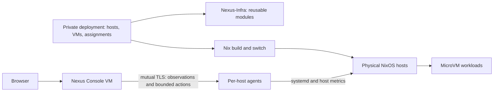

# Nexus Infra

Nexus is a small NixOS infrastructure project for describing physical hosts, running MicroVM workloads, and understanding their live state. Its aim is to keep reproducible configuration, persistent application data, and day-to-day operations understandable as a deployment grows.

This repository contains **reusable modules and the Nexus Console implementation**. Your machines, workloads, addresses, storage mappings and access policy belong in a separate private deployment repository. Nexus is an experimental single-host-tested foundation, not a production-ready cluster orchestrator.

## Desired state and live state

- **Desired state** is the Nix configuration committed to the deployment repository and pinned by its flake lock. Building evaluates it; switching activates it.
- **Live state** is what hosts and VMs are actually doing. The console observes host agents and compares runtime state with the **activated** declarations. It does not inspect pending Git edits or automatically reconcile differences.



The dependency is always **private deployment → Nexus-Infra**. This repository neither imports nor requires access to anyone's private deployment.

## What exists today

| Part | Current responsibility |
| --- | --- |
| Physical hosts | NixOS configuration, KVM, VM lifecycle, host networking and storage backends |
| MicroVM workloads | Declarative NixOS guests; QEMU/KVM defaults, a read-only host Nix-store share, optional persistent directories |
| Persistent storage | A guest requests a named mount; the deployment supplies its host directory; startup waits for the backing filesystem |
| Networking | Deployment-defined VM interfaces, addresses, bridge, firewall and egress policy; no automatic cross-host network |
| Ingress | The current private deployment uses a Traefik VM for local HTTP routing to workloads and the console |
| Network control | The current private deployment runs Headscale for coordination; ordinary VM traffic does not pass through it |
| Nexus Console | Host/VM observations, storage relationships, topology, health probes, action history and explicitly permitted VM lifecycle controls |

**Ingress and Headscale are currently private deployment components**, not exported public Nexus modules. Public modules do not create those VMs or choose addresses, disks, certificates or a network topology for you. The current deployment has not enrolled Tailscale clients or established a cross-host data plane.

## Exported modules

Import these from `nexus-infra.nixosModules`:

| Export | Scope | Purpose |
| --- | --- | --- |
| `host-base` | Physical host | Opinionated baseline for flakes, boot, SSH and administration tools |
| `microvm-host` | Physical host | Pinned upstream `microvm.nix` integration and mount-aware share startup |
| `nexus-agent` | Physical host | Unprivileged observation service with allowlisted systemd actions |
| `vm-base` | Guest | QEMU/KVM, 1 vCPU, 256 MiB RAM and read-only Nix-store sharing by default |
| `vm-persistent` | Guest | `nexus.persistence.<name>.mountPoint` and deployment-supplied `source` |
| `nexus-console` | Guest | Console service; deployment supplies inventory, credentials and persistent storage |

Review `host-base` before importing it: it enables UEFI systemd-boot, DHCP and SSH **password authentication**, disables root SSH login, selects `Europe/Berlin`, and sets state version `26.05`. These are existing baseline choices, not a hardening policy. Override them deliberately for your machine; preserve working administration access. Do not change an existing machine's `system.stateVersion` just to match a release.

## Use Nexus in your own deployment

Your private flake consumes this public repository:

```nix
inputs = {
  nixpkgs.url = "github:NixOS/nixpkgs/nixos-26.05";
  nexus-infra.url = "github:JBHoerter/Nexus-Infra";
  nexus-infra.inputs.nixpkgs.follows = "nixpkgs";
};
```

Commit your `flake.lock`; it pins Nexus, nixpkgs and the upstream MicroVM input. A second public fork is not required to create your own private deployment.

See [Create a deployment](docs/deployment.md) for a minimal host flake and a first VM, and [Storage and networking](docs/storage-network.md) for the deployment boundaries. Run host changes on the intended NixOS host, for example:

```sh
ssh -t YOUR_HOST 'cd /path/to/your/deployment && sudo nixos-rebuild build --flake .#my-host'
ssh -t YOUR_HOST 'cd /path/to/your/deployment && sudo nixos-rebuild switch --flake .#my-host'
```

A build does not activate configuration; switching can restart changed services and VMs. Back up persistent state separately: a flake reproduces configuration, not application data or runtime credentials.

## Nexus Console

The purpose-built console VM uses a Python standard-library backend and a static JavaScript/CSS interface. Host agents sample systemd, host CPU/memory, filesystem capacity, network interfaces and configured HTTP probes. The console polls agents concurrently and browsers poll its cache every five seconds while visible. Unreachable hosts retain clearly marked stale observations.

Actions are limited to configured VM start/stop/restart operations. Authentication, CSRF/Origin checks, mutual TLS and per-unit polkit rules form the boundary; there is no browser shell or arbitrary command endpoint. Runtime credentials and audit state stay outside Git and the Nix store. See [Console architecture and API](console/README.md).

The data model identifies hosts and their workloads separately and accepts multiple agent endpoints. Only a single physical host has been validated; additional-host networking, enrollment and certificate lifecycle remain deployment work.

## Repository layout

```text
flake.nix / flake.lock     Public exports and pinned dependencies
host-modules/             Reusable physical-host capabilities
vm-modules/               Reusable guest capabilities
console/                  Agent, management API, frontend and security tests
docs/                     Deployment, storage and networking guidance
```

## Limits and contributing

There is no scheduler, migration, automatic failover, distributed storage, historical metrics database or automatic desired-state reconciliation. Persistent volumes share filesystem capacity without per-volume quotas. Console authentication currently has one administrator; certificate rotation is manual. The current deployment uses LAN HTTP ingress, not public TLS/DNS or a production access policy.

Keep reusable mechanisms here and concrete assignments in the deployment. Never commit passwords, private keys, tokens or mutable guest state—even to a private repository. `.gitignore` is only a convenience, not a secret scanner. Public contributions must also avoid private addresses, disk IDs and deployment-specific paths.

For backend changes, run `PYTHONDONTWRITEBYTECODE=1 python3 -m unittest discover -s console -v`. For Nix changes, build a consuming deployment and verify the relevant lifecycle/network/persistence behavior. See the deployment guide for a local input override that avoids publishing unfinished changes.
