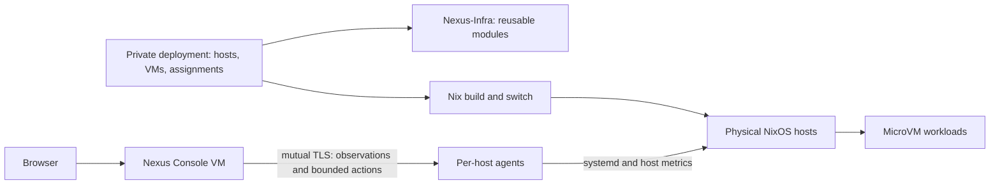

# Nexus Infra

Nexus is a small NixOS infrastructure project for describing physical hosts, running MicroVM workloads, and understanding their live state. Its aim is to keep reproducible configuration, persistent application data, and day-to-day operations understandable as a deployment grows.

This repository contains **reusable modules and the Nexus Console implementation**. Your machines, workloads, addresses, storage mappings and access policy belong in a separate private deployment repository. Nexus is an experimental single-host-tested foundation, not a production-ready cluster orchestrator.

## Desired state and live state

- **Desired state** is the Nix configuration committed to the deployment repository and pinned by its flake lock. Building evaluates it; switching activates it.
- **Live state** is what hosts and VMs are actually doing. The console observes host agents and compares runtime state with the **activated** declarations. It does not inspect pending Git edits or automatically reconcile differences.



The dependency is always **private deployment → Nexus-Infra**. This repository neither imports nor requires access to anyone's private deployment.

## What exists today

| Part | Current responsibility |
| --- | --- |
| Physical hosts | NixOS configuration, KVM, VM lifecycle, host networking and storage backends |
| MicroVM workloads | Declarative NixOS guests; QEMU/KVM defaults, a read-only host Nix-store share, optional persistent directories |
| Persistent storage | A guest requests a named mount; the deployment supplies its host directory; startup waits for the backing filesystem |
| Networking | Deployment-defined VM interfaces, addresses, bridge, firewall and egress policy; no automatic cross-host network |
| Ingress | The current private deployment uses a Traefik VM for local HTTP routing to workloads and the console |
| Network control | The current private deployment runs Headscale for coordination; ordinary VM traffic does not pass through it |
| Nexus Console | Host/VM observations, storage relationships, topology, health probes, action history and explicitly permitted VM lifecycle controls |

**Ingress and Headscale are currently private deployment components**, not exported public Nexus modules. Public modules do not create those VMs or choose addresses, disks, certificates or a network topology for you. The current deployment has not enrolled Tailscale clients or established a cross-host data plane.

## Exported modules

Import these from `nexus-infra.nixosModules`:

| Export | Scope | Purpose |
| --- | --- | --- |
| `host-base` | Physical host | Opinionated baseline for flakes, boot, SSH and administration tools |
| `microvm-host` | Physical host | Pinned upstream `microvm.nix` integration and mount-aware share startup |
| `nexus-agent` | Physical host | Unprivileged observation service with allowlisted systemd actions |
| `vm-base` | Guest | QEMU/KVM, 1 vCPU, 256 MiB RAM and read-only Nix-store sharing by default |
| `vm-persistent` | Guest | `nexus.persistence.<name>.mountPoint` and deployment-supplied `source` |
| `nexus-console` | Guest | Console service; deployment supplies inventory, credentials and persistent storage |
| `workload-base` | nspawn workload | Inner profile for workload containers: nspawn mode, no DHCP/host resolv.conf, no inner Nix |
| `workload-docker` | nspawn workload | `workload-base` plus nested Docker pinned to `crun` with a bounded process limit |

Review `host-base` before importing it: it enables UEFI systemd-boot, DHCP and SSH **password authentication**, disables root SSH login, selects `Europe/Berlin`, and sets state version `26.05`. These are existing baseline choices, not a hardening policy. Override them deliberately for your machine; preserve working administration access. Do not change an existing machine's `system.stateVersion` just to match a release.

## Use Nexus in your own deployment

Your private flake consumes this public repository:

```nix
inputs = {
  nixpkgs.url = "github:NixOS/nixpkgs/nixos-26.05";
  nexus-infra.url = "github:JBHoerter/Nexus-Infra";
  nexus-infra.inputs.nixpkgs.follows = "nixpkgs";
};
```

Commit your `flake.lock`; it pins Nexus, nixpkgs and the upstream MicroVM input. A second public fork is not required to create your own private deployment.

See [Create a deployment](docs/deployment.md) for a minimal host flake and a first VM, and [Storage and networking](docs/storage-network.md) for the deployment boundaries. Run host changes on the intended NixOS host, for example:

```sh
ssh -t YOUR_HOST 'cd /path/to/your/deployment && sudo nixos-rebuild build --flake .#my-host'
ssh -t YOUR_HOST 'cd /path/to/your/deployment && sudo nixos-rebuild switch --flake .#my-host'
```

A build does not activate configuration; switching can restart changed services and VMs. Back up persistent state separately: a flake reproduces configuration, not application data or runtime credentials.

## Nexus Console

The purpose-built console VM uses a Python standard-library backend and a static JavaScript/CSS interface. Host agents sample systemd, host CPU/memory, filesystem capacity, network interfaces and configured HTTP probes. The console polls agents concurrently and browsers poll its cache every five seconds while visible. Unreachable hosts retain clearly marked stale observations.

Actions are limited to configured VM start/stop/restart operations. Authentication, CSRF/Origin checks, mutual TLS and per-unit polkit rules form the boundary; there is no browser shell or arbitrary command endpoint. Runtime credentials and audit state stay outside Git and the Nix store. See [Console architecture and API](console/README.md).

The data model identifies hosts and their workloads separately and accepts multiple agent endpoints. Only a single physical host has been validated; additional-host networking, enrollment and certificate lifecycle remain deployment work.

## Repository layout

```text
flake.nix / flake.lock     Public exports and pinned dependencies
host-modules/             Reusable physical-host capabilities
vm-modules/               Reusable guest capabilities
console/                  Agent, management API, frontend and security tests
docs/                     Deployment, storage and networking guidance
```

## Development model

Nexus is built incrementally in agent-driven passes. A planning conversation produces a bounded prompt — scope, safety rules, inspection-before-change — and an agent executes it over SSH against the target host; each pass lands as commits validated on the running system before the next begins. Work so far was executed by Codex from prompts drafted in a separate ChatGPT planning conversation.

Per-commit provenance and session history are tracked with [Partial](https://github.com/JBHoerter/Partial): a `post-commit` hook plus `.devin/` agent hooks record sessions, and `partial checkpoints` in a checkout shows which session produced each commit. The original transcripts are imported, so `partial search` and the dashboard answer "why was this built this way" directly.

Design intent beyond the current pass, in rough priority order:

- **Fresh-host reproducibility** — provision a new VPS (e.g. Hetzner via `nixos-anywhere` or a pre-built NixOS ISO) and reach the same configuration from this flake plus the private deployment.
- **Separated data layer** — persistent application data lives on dedicated storage so compute can be rebuilt from pinned configuration alone.
- **AI-agent operators** — a dev environment where agents run *against* the infrastructure from inside it.
- **Public ingress** — Cloudflare/DNS/TLS-terminated ingress is deliberately deferred until LAN-mode routing is proven. Headscale stays coordination-only; workload traffic should eventually flow peer-to-peer.
- **Mail service** — a Mailcow-class appliance is under evaluation; it is the least Nix-native piece and not committed yet.

## Limits and contributing

There is no scheduler, migration, automatic failover, distributed storage, historical metrics database or automatic desired-state reconciliation. Persistent volumes share filesystem capacity without per-volume quotas. Console authentication currently has one administrator; certificate rotation is manual. The current deployment uses LAN HTTP ingress, not public TLS/DNS or a production access policy.

Keep reusable mechanisms here and concrete assignments in the deployment. Never commit passwords, private keys, tokens or mutable guest state—even to a private repository. `.gitignore` is only a convenience, not a secret scanner. Public contributions must also avoid private addresses, disk IDs and deployment-specific paths.

For backend changes, run `PYTHONDONTWRITEBYTECODE=1 python3 -m unittest discover -s console -v`. For Nix changes, build a consuming deployment and verify the relevant lifecycle/network/persistence behavior. See the deployment guide for a local input override that avoids publishing unfinished changes.

### Isolated system-container feasibility checks

On an x86_64-linux Nix builder with KVM and the `nixos-test` system feature:

```sh
nix build --no-link --print-build-logs --max-jobs 1 --cores 2 \
  .#checks.x86_64-linux.nspawn-native \
  .#checks.x86_64-linux.nspawn-docker
```

These checks run disposable NixOS test machines, not services on the builder. They exercise private user/network namespaces, restricted mounts, synthetic state transfer, and Docker Compose inside an outer container using the pinned `crun` runtime. The native check uses two 1536 MiB test machines; the Docker check uses one 3072 MiB machine. New files must be tracked for Git-backed flake evaluation, or evaluated using a `path:` source during development. Passing these synthetic checks does not establish Mailcow compatibility, production isolation, or automated workload recovery.

The Mailcow netfilter component check is available as `checks.x86_64-linux.nspawn-mailcow-netfilter`. It fetches digest-pinned public images and tests the nftables backend with reduced network capabilities inside the outer container; it is not a full Mailcow integration test. This component probe uses an isolated Redis fixture and IP-only rules; it does not validate live DNS, SMTP/IMAP, stock privileged Compose behavior, or application-data restoration.

### Explicit Mailcow integration lab

`packages.x86_64-linux.mailcow-integration-lab` builds a test driver for an explicitly run, disposable integration VM. It is not part of the default flake checks because stock DNS health checks and antivirus updates require network access.

Run only on a suitable x86_64-linux KVM builder. The VM uses 8 GiB RAM, two virtual CPUs and a sparse 32 GiB disk. Before starting, require at least 11 GiB available host RAM and 40 GiB available disk space. Run one lab at a time; never activate its configuration on a real host.

```sh
driver=$(nix build --no-link --print-out-paths --max-jobs 1 --cores 2 .#mailcow-integration-lab)
run_dir=$(mktemp -d /tmp/nexus-mailcow-run.XXXXXX)
(cd "$run_dir" && XDG_RUNTIME_DIR="$run_dir" "$driver/bin/nixos-test-driver" \
  --keep-machine-state --output_directory "$run_dir" --junit-xml "$run_dir/results.xml")
```

Use a fresh run directory for each complete execution. The test creates a synthetic domain/mailbox and sends one internal message; replaying the entire script against a completed saved state is not an idempotent recovery operation. Retained VM disks contain synthetic credentials and must remain access-restricted. Disk-backed `XDG_RUNTIME_DIR` avoids filling a small user runtime tmpfs.

The lab uses frozen source/image inputs from `tests/mailcow-lab-inputs.json`, a private UID mapping, pinned `crun`, and a declared process-limit envelope. Mailcow netfilter uses its nftables backend with only `NET_ADMIN`/`NET_RAW` rather than privileged mode. A VM-level egress guard blocks external SMTP and private-network access while allowing initialization DNS, HTTP(S) and ICMP. No host ports are forwarded. Certificates and credentials are generated inside the fixture, and certificate verification remains strict.

Coverage includes stable startup of all 18 services, required Unbound/ClamAV health checks, API domain/mailbox creation, authenticated TLS submission, exact-content IMAP retrieval, and message/certificate persistence after outer-container restart. This is an IPv4 lab with a private test CA and internal delivery. It does not certify public SMTP deliverability, public ACME renewal, IPv6, backup restoration, host-loss recovery or upstream support for nested Mailcow.

Pure helper regressions can run without Nix or Docker:

```sh
PYTHONDONTWRITEBYTECODE=1 python3 -m unittest discover -s tests -p test_mailcow_lab.py -v
```

The Home Assistant/Mosquitto nested-runtime check is `checks.x86_64-linux.nspawn-homeassistant`. It preloads digest-pinned Home Assistant and Mosquitto images, runs both non-privileged under `crun` inside the outer container, verifies that container `network_mode: host` stays inside the workload network namespace, and checks that the Mosquitto retained-message database and the Home Assistant identity and configuration bytes survive an outer-container restart. It is a runtime, isolation and persistence probe only: it does not establish onboarding/authentication correctness, real MQTT integrations, radio hardware support, LAN/multicast discovery, or recovery onto a different host.

The Govee LAN/MQTT component check is `checks.x86_64-linux.nspawn-govee`. A synthetic device fixture on the simulated VM host answers multicast discovery and LAN API commands while digest-pinned govee2mqtt and Mosquitto run non-privileged under `crun` inside the outer container. It verifies LAN API discovery, MQTT-to-LAN command translation, workload-namespace confinement, and repeat behavior after an outer-container restart. It uses no real hardware, credentials or cloud API: physical device behavior, Home Assistant integration, Govee cloud features and recovery onto a different host remain unverified.

The Antragsbank runtime/transfer lab is exported as the parameterized factory `lib.tests.antragsbank`; the private repository invokes it with a sanitized source artifact, a frozen wheelhouse and the immutable event-controls file. It runs the application non-privileged under `crun` inside the outer container, seeds synthetic SQLite/Chroma state without network access, verifies authenticated event listing plus exact acknowledged proposal records compared as complete JSON records across restarts and transfer, checks SQLite integrity, FTS contents, Chroma vectors and control/env bytes across an outer-container restart, and performs a controlled cold state transfer to a fresh simulated host via a numeric-owner tar archive while the source remains stopped. It proves synthetic runtime/API/state behavior and cold transfer only: no production data or credentials are used, equivalence with the running production image is unverified, and it is not a backup engine, fencing mechanism, automatic recovery or host-loss guarantee.

### Host-independent workload artifacts

`lib.buildWorkload` takes a draft workload definition (the `schemaVersion: 2` catalog shape without `revisionDigest` or a runtime artifact entry) plus trusted Nix modules, and returns `{ system; bundle; }`. `system` is a standalone `nixpkgs.lib.nixosSystem` built once from `workload-modules/base.nix`, a hostname module and the caller's modules. It is deliberately not a physical host's `containers.<name>.config`, which embeds host-local settings such as addresses. Hosts bind the shared `system.config.system.build.toplevel` through their own `containers.<name>.path` and supply their own private UID ranges, private-network addresses and physical bind mounts.

`bundle` is a Nix-store directory containing a content-addressed manifest: `artifact.json` (the canonical manifest — closure root, sorted store-path entries with NAR hashes and references), `artifact.sha256` and `definition.json` (the sealed catalog definition carrying the manifest digest as its `runtimeArtifactId` entry). The digest covers the exact manifest JSON bytes, not store-path names; the bundle references the Nix store closure rather than archiving a disk image. It does not verify cache signatures, prove distribution, or provide recovery.

The workload profiles are inner-container configuration only. The host must provide private users, private networking, socket and cgroup boundaries, and persistent bind mounts such as `/var/lib/docker` and `/var/lib/containerd` where needed; importing a profile alone enforces no outer isolation or networking.

`checks.x86_64-linux.workload-artifact` builds one canary workload and binds it on two simulated hosts with different UID offsets, private-network addresses and physical state directories. It verifies the same system closure and guest hostname on both hosts, host-visible UID mapping differences, host-only sentinel and Nix-socket invisibility, a read-only store, and that file bytes copied between the stopped host state directories appear on the second host. This is a binding and layout-portability proof only — not worker orchestration, admission, backup, fencing or automatic recovery.
