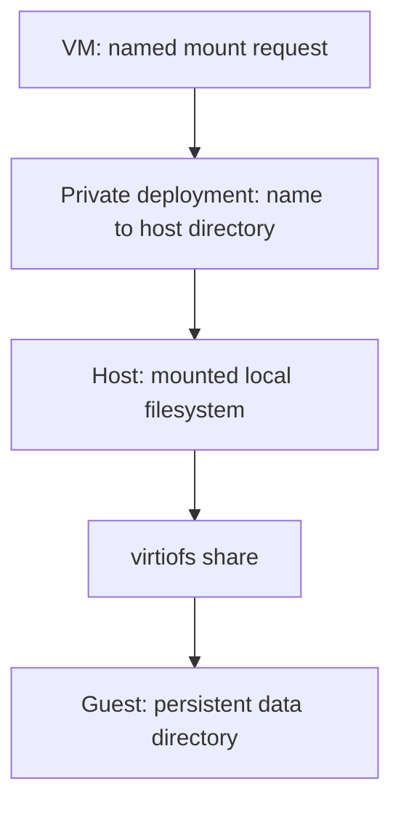
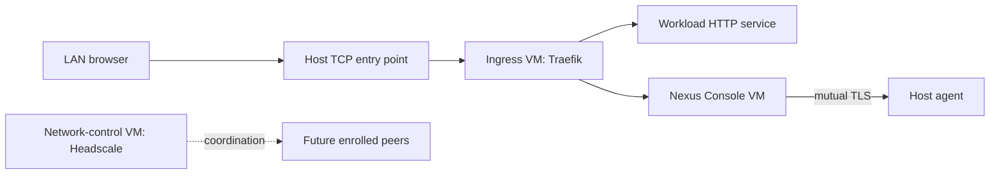

# Storage and networking boundaries

Nexus currently supplies small reusable mechanisms. The deployment decides which disk, directory, interface and address each workload uses.

## Persistent storage

`vm-persistent` defines `nexus.persistence` as named entries with two required fields:

- `mountPoint`: absolute guest path, declared with the concrete guest.
- `source`: absolute host directory, supplied by deployment placement.

Names must contain only letters, digits, underscores or hyphens. These entries generate virtiofs shares. The public `microvm-host` module orders fully declarative guests and their share daemons after backing mounts and tmpfiles directory preparation. It does not select, partition, format or migrate storage.

A guest service using persistent data should also declare `RequiresMountsFor` for its guest mount. Persist service databases, generated identities and SSH host keys where appropriate; leave the rest of the guest reproducible/ephemeral. Restarting a VM retains a share's contents, but deleting or losing the host directory does not.

virtiofs preserves **numeric ownership**. Reserve suitable service UIDs/GIDs across host and guests; an automatically chosen guest UID can otherwise match an unrelated host daemon. Protect credential directories and files with restrictive modes. Runtime secrets must not be embedded in Nix expressions, source files, or derivations: the Nix store is not a secret store.

Current storage is host-local, without automatic replication, snapshots, quotas, distributed storage or backup. A future VM move would need both storage availability and an explicit placement/network change; none of that is implemented automatically. Console capacity figures describe filesystems, not per-directory consumption or reservations.

## Network foundation

The current private deployment uses one private Linux bridge and one TAP per VM. The physical management/LAN interface stays separate. The deployment assigns MAC/IP addresses, host bridge configuration, guest networkd configuration, firewall openings and any narrowly scoped outbound NAT. Public modules contain no site-specific addressing plan.

The existing local ingress forwards HTTP requests to a test workload and the console. The host TCP proxy transports connections; routing is inside Traefik. This arrangement does not preserve the original client IP at the reverse proxy. It is not public ingress and has no production DNS, public certificates or Internet publication configured.

Headscale is a **coordination service**, not a path through which all VM traffic must pass. Current same-host VM traffic crosses the bridge directly. No overlay clients are enrolled; cross-host addressing, peer connectivity and relay policy have not been implemented or validated. Direct peer-to-peer traffic is an intention for a later deployment design, not an existing Nexus guarantee.

The host agent's management listener should be reachable only by the console. Mutual TLS verifies host identity and requires a client certificate; host-ID/schema checks also guard against misrouted observations. Browser ingress needs its own authentication and transport policy. Current test HTTP is LAN-only; use a trusted SSH tunnel where appropriate and design TLS before broader exposure.

## What belongs where

| Public mechanism | Private deployment responsibility |
| --- | --- |
| Guest persistence options and virtiofs generation | Disk identity, filesystem mount, directory mapping, ownership, backup |
| MicroVM host integration and guest defaults | Concrete VM definitions and host placement |
| Console/agent services and bounded action protocol | Inventories, endpoint addresses, controllable VM allowlist, runtime PKI |
| No automatic network topology | Bridge/TAP setup, IP/MAC assignment, routing, firewall and egress |
| No public Headscale/Traefik module yet | Concrete network-control and ingress service configuration |
